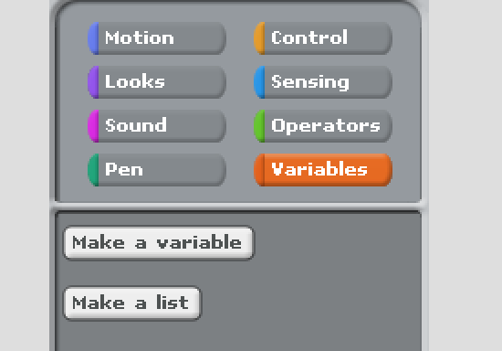
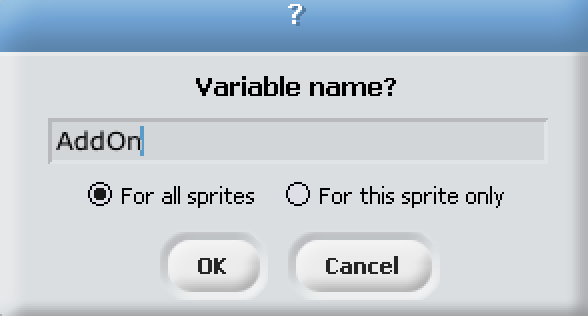
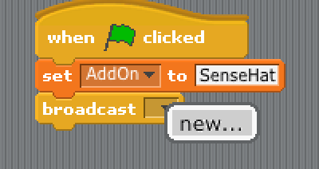
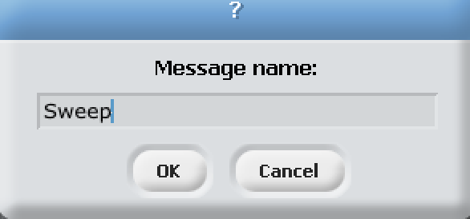

# Scratch-ing the surface of space
## What will you do?
Scratch is a visual programming tool which allows the user to create animations and games with a drag-and-drop interface. It allows you to create your own computer games, interactive stories, and animations using some programming techniques without actually having to write code.
In this workshop you'll learn how to control the raspberry pi's sense hat (a real astronauts's tool) using scratch.
## What will you learn?
By following the steps in this tutorial, you will learn:

- How to set up the sense hat with scratch
- Using the LEDs on the sense hat
- Using the joystick on the sense hat

## Getting started
You'll find Scratch GPIO 7 on the desktop of Raspbian. Once opened you will see a window like this:

Yours may look different, thats not a problem.
We won't be using any of the right hand side, with the exception of the flag button and the stop button to test our code.

## Lets test our sense hat
Will start of by testing our sense hat to make sure it's been connected alright and it's working fine. By doing this we will also learn how to setup the sense hat on scratch.

1. Click on the Block Palette and select **Control**
2. Next drag a **When green flag clicked** block and place it on the scripts area in the middle of the screen.
3. Click on the the Block Palette and select **Vriables**

4. Click on **Make a variable**
5. Name your variable **AddOn** and press **Ok**

6. Than add a orange **set** block from the **variables** blocks and connect it to the **When green flag clicked** block
7. Since the only variable we have so far is the **AddOn** one it should automatically be selected, if it isn't click the **little black arrow** pointing down on the **set** block and select **AddOn**
8. Click on the little **white box** at the end of the **set** block, the one with the number **0** in it. Everything should now be highlighted blue, now type in **SenseHat**.

Congrats You've just set up the sense hat on scratch. You should have something like this on your screen

Now lets test the sense hat.

1. Click on the Block Palette and select **Control** again
2. This time we are selecting the **broadcast** block and connecting it to the **set** block
3. Now click on the **little black arrow** at the end of the broadcast block and click on **new...**

4. Now name the message **Sweep**, now it's really important that you **spell sweep just as i did** including the capital letter. Now press Ok to finish it off.

5. We've done it. All we need to do now is press the **green flag button** to see the results. You should see your sense hat start to light up row by row.

But now you see we have a problem. The LEDs are not turning off. This is a problem if we want to do anything with the sense hat's LEDs.

To fix this all we need to do is create a new **broadcast** with the message **Clear**. Look at the previous steps that we used to create the first broadcast. Use those steps to create a new broadcast, but this time give the message the name Clear instead of Sweep.
You should have something looking like this:

Now run the program and see how it turns off all the LEDs after they all turn on.
