# Scratch-ing the surface of space
## What will you do?
Scratch is a visual programming tool which allows the user to create animations and games with a drag-and-drop interface. It allows you to create your own computer games, interactive stories, and animations using some programming techniques without actually having to write code.
In this workshop you'll learn how to control the raspberry pi's sense hat (a real astronauts's tool) using scratch.
## What will you learn?
By following the steps in this tutorial, you will learn:

- How to set up the sense hat with scratch
- Using the LEDs on the sense hat
- Using the joystick on the sense hat

## Getting started
You'll find Scratch GPIO 7 on the desktop of Raspbian. Once opened you will see a window like this:

Yours may look different, thats not a problem.
We won't be using any of the right hand side, with the exception of the flag button and the stop button to test our code.

## Lets test our sense hat
Will start of by testing our sense hat to make sure it's been connected alright and it's working fine. By doing this we will also learn how to setup the sense hat on scratch.

1. Click on the **Block Palette** and select **Control**
2. Next drag a **When green flag clicked** block and place it on the scripts area in the middle of the screen.
3. Click on the the Block Palette and select **Vriables**

4. Click on **Make a variable**
5. Name your variable **AddOn** and press **Ok**

6. Than add a orange **set** block from the **variables** blocks and connect it to the **When green flag clicked** block
7. Since the only variable we have so far is the **AddOn** one it should automatically be selected, if it isn't click the **little black arrow** pointing down on the **set** block and select **AddOn**
8. Click on the little **white box** at the end of the **set** block, the one with the number **0** in it. Everything should now be highlighted blue, now type in **SenseHat**.

Congrats You've just set up the sense hat on scratch. You should have something like this on your screen
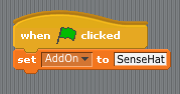

Lets explain variables real quick. Think of variables as boxes that you put things inside. You can Put in a number or a word so you can use it later.
In this case we told Scratch that we where using the Sense Hat by giving a variable the word SenseHat.
Whats inside a variable can be changed at any time with the set **block**

Now lets test the sense hat.

1. Click on the **Block Palette** and select **Control** again
2. This time we are selecting the **broadcast** block and connecting it to the **set** block
3. Now click on the **little black arrow** at the end of the broadcast block and click on **new...**

4. Now name the message **Sweep**, now it's really important that you **spell sweep just as i did** including the capital letter. Now press Ok to finish it off.

5. We've done it. All we need to do now is press the **green flag button** to see the results. You should see your sense hat start to light up row by row.
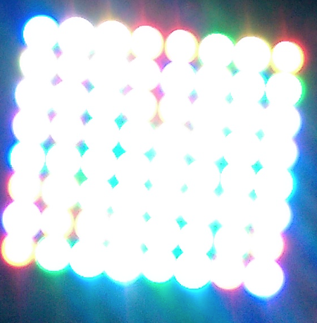

But now you see we have a problem. The LEDs are not turning off. This is a problem if we want to do anything with the sense hat's LEDs.

To fix this all we need to do is create a new **broadcast** with the message **AllOff**. Look at the previous steps that we used to create the first broadcast. Use those steps to create a new broadcast, but this time give the message the name AllOff instead of Sweep.
You should have something looking like this:

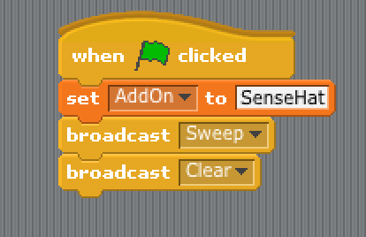

Now run the program and see how it turns off all the LEDs after they all turn on.

## Lighting up one LED
For this bit we can re-use some of the most of the last peace of work. All we are going to do is light up one of the LEDs. Lets get right into it than.

1. Drag the last **broadcast** block from the last example so that it's not connected anymore, place it anywhere.
2. **Right click** the **broadcast** block we just disconnected and than click **delete**
3. Now click the **broadcast** that still there and make it a **AllOff** message. You should have something like this:
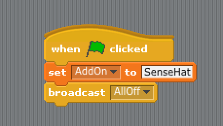
4. Now we're going to set up 2 new **variables**. One named **x** and the other named **y**, remember we've done this before already. If you're not sure how to do it go back and check on previous steps
5. Now we are going to **set** the value of **x** and **y** to **0**. You should have something looking like this:
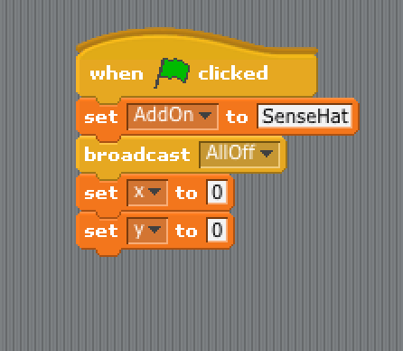
6. Now we're going to add a new **broadcast** to the end of it.
7. Instead of changing the message of the **broadcast** were going to add a couple of **joins** to the mix. Click on **operator** on the **Block Pallett**. Drag the **join inside of the broadcast**.
8. Name the first block of the **join Pixel**
9. Drag another **join** block to the end of the previous **join** block
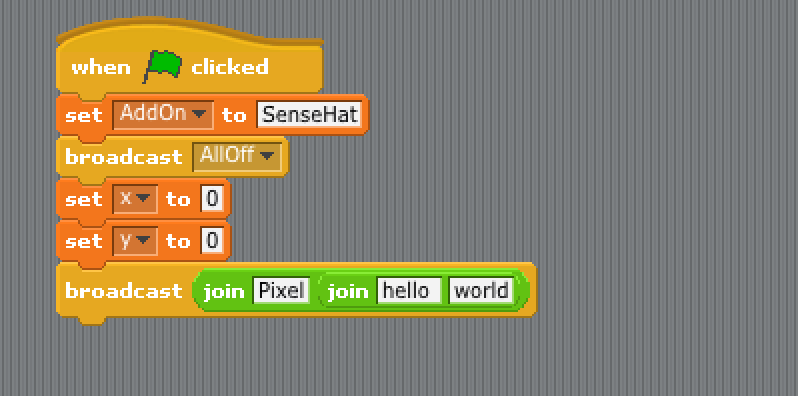
10. Now add two more **join** blocks inside that new **join** block. You should have something like this now:
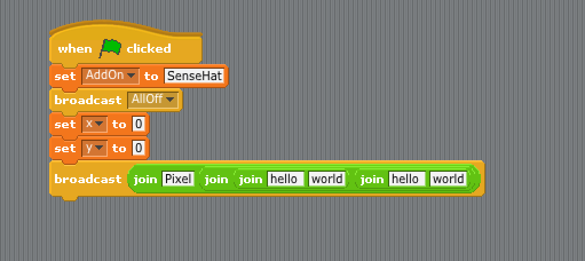
11. Now You should have 4 boxes inside the **join** blocks, two with the word **_'hello'_** written in them and two with the word **_'world'_** written in them. We are going to change that now, the first box with the word **_'hello'_** in should have the variable **x** we created earlier. To do that go into the **Variables** block in the **block Pallett** and drag the little circle with an x inside of it  to that first 'hello'
12. The white box infront of the last one, the first one with the word **_'world'_** in, should have a **comma** instead of the word **_'world'_**  
13. The next white box should have the variable **y** inside it
14. And the last box inside all of those joins should have **White** written inside it. It should all look something like this:
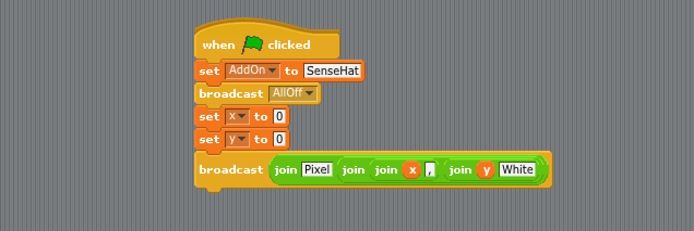

The join block joins words and variable together into one thing. So what we just broadcasted was Pixel 0,0 White. We could have just created a new message saying just that and used that instead. But than if we wanted to change anything we would have to create new messages for each one. By using variables we can change parts of the messages with out having to create new messages all the time
Now to explain what we just did. The variable x is used to tell scratch how many LED's to left we want to go, the y variable is used to tell scratch how many LEDs down we want to go up by. We just told Scratch that we did not want to go up and that we did not want to go to left which made it turn on the very first LED.

## Creating a galaxy
Now we are going to learn how to create a galaxy using random numbers.

1. First click and hold on the first set block after the first broadcast from the last example. Drag it so it disconnects from the broadcast. **DO NOT DELETE** we are going to re use it, just put it to the side for now. It should look something like this (your disconnected bit doesn't have to be in the same place as mine)
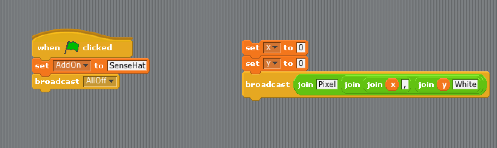
2. Now click on the **Control** block in the **Block Pallett**. Drag the **repeat** block and connect it to the **broadcast** connected to the green flag. Give it the number **5**. You should have something like this:
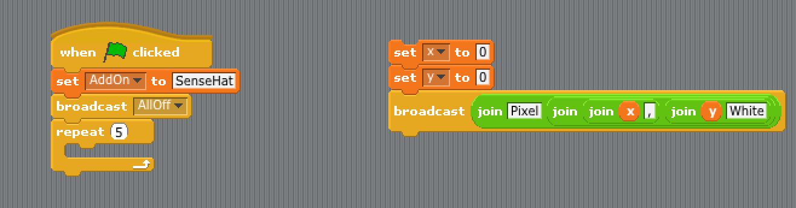
3. Now drag the blocks we disconnected earlier into the **repeat** block
4. Click the **Operator** block in the **Block Pallett** drag the **pick random** block into both of the **set** block inside the repeat. Give the boxes the value of 1 and 5 for each of the **pick random** bloc. Give the boxes the value of 1 and 5 for each of the **pick random** block. It should look something like this:
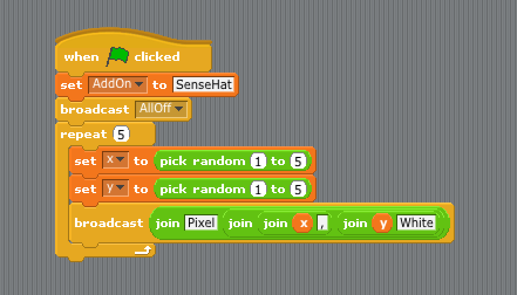

There we have it, we've created a galaxy.

The **pick random** block picks a random number in between the two numbers we told it.
The **repeat** block repeats whatever is inside it however many times we tell it.

## Using the joystick
Now we're going to learn how to use the joystick to create new galaxies. 
Before we start I need to tell you that the joystick on the sense hat is the same as the arrow keys on your keyboard
Now lets get right to it than.

1. Disconnect the **repeat** block. **Do not delete it** we are going to re-use it later.
2. Click the **control** block in the **Block Pallett**, drag the **forever** block and connect it to our program. You should have something like this:
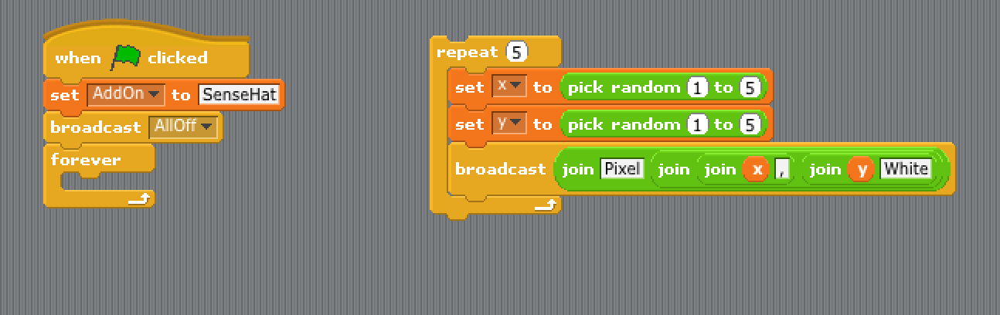
3. While we are in the **Control** block select the **if** block and place it in the **forver** block
4. The **if** block has a slot (not the empty space inside it). This is where we put the the **condition** for running the code inside the **if** block. We can find the condition we want in the block **Sensing** inside the **Block Pallett**. Drag and drop the **key pressed** block into the if block slot space. It should look something like this:
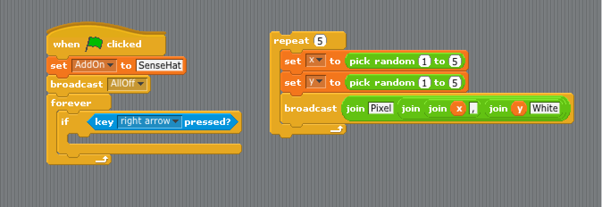
5. Make sure the key we are waiting to be pressed is one of the arrow keys, I chose the right arrow key for my example
6. Now drag the block we preveusly disconnected into the **if** block. It should look something like this:

7. Now for the final stage click the **Control** block in the **Block Pallett**. Select the **wait** block, drag and drop it at the end of the **forever** block (but still inside it). It usually defaults to 1, if it isn't one please put 1 inside it. We are now done. You Should have something looking like this:
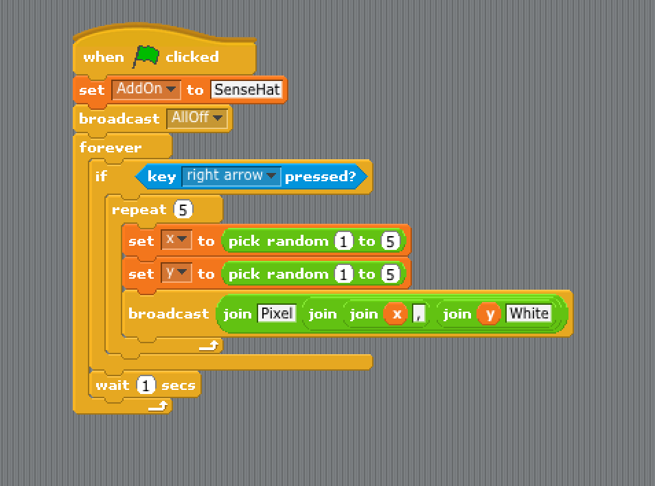
